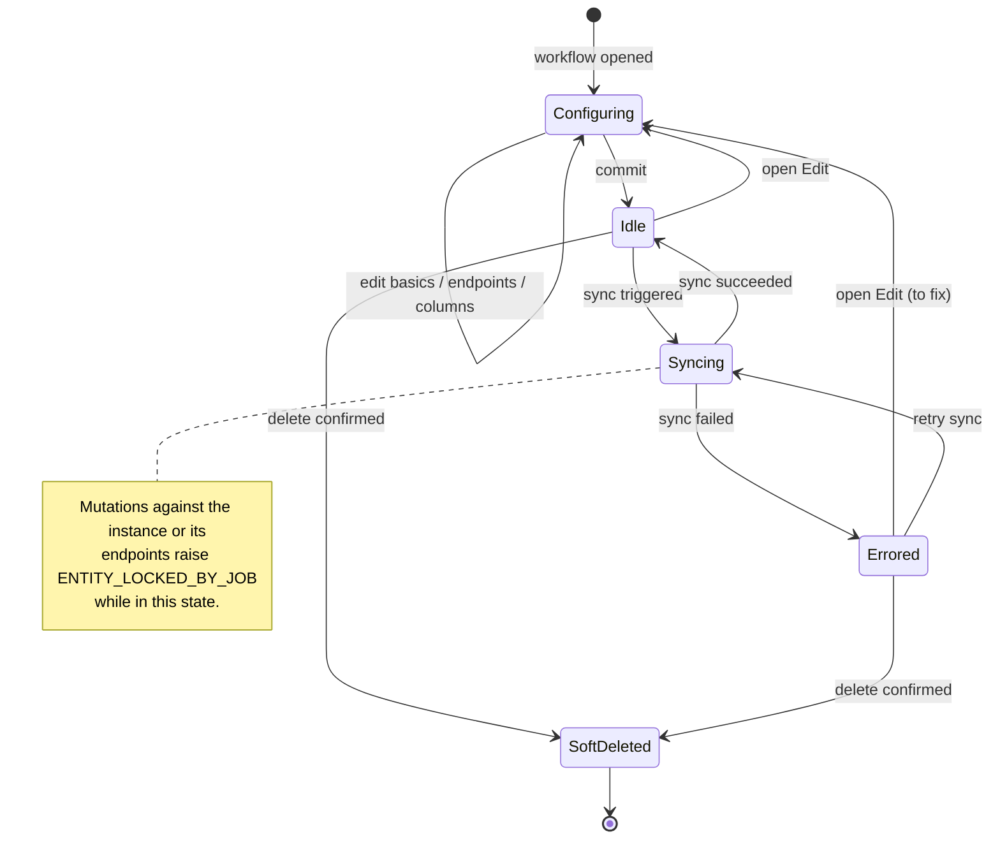
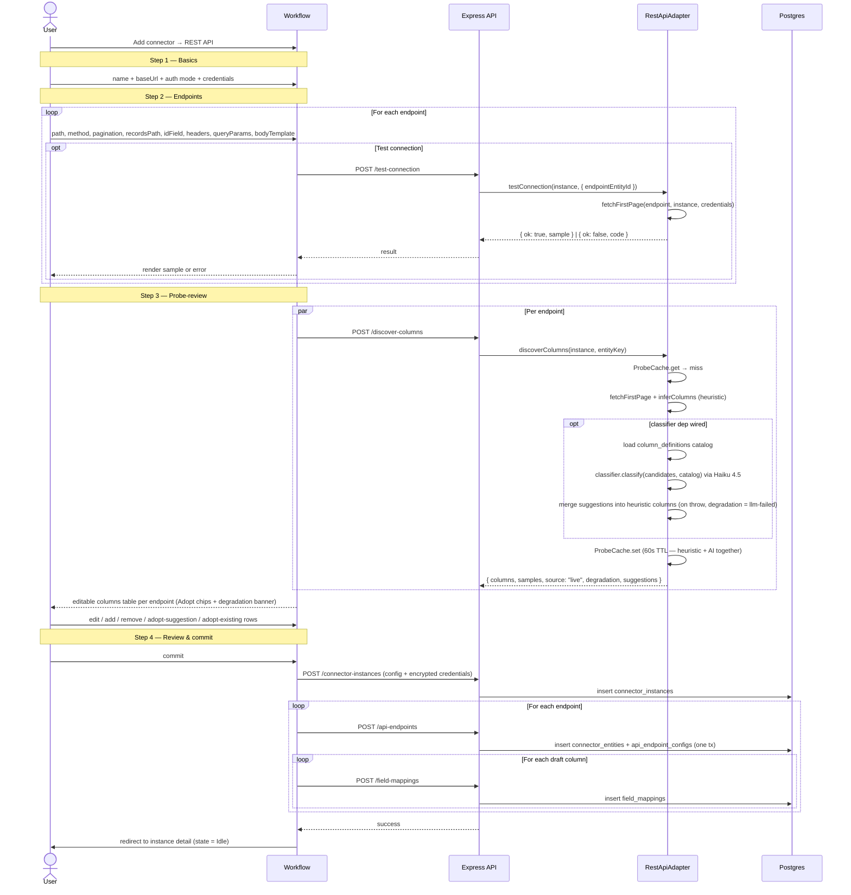
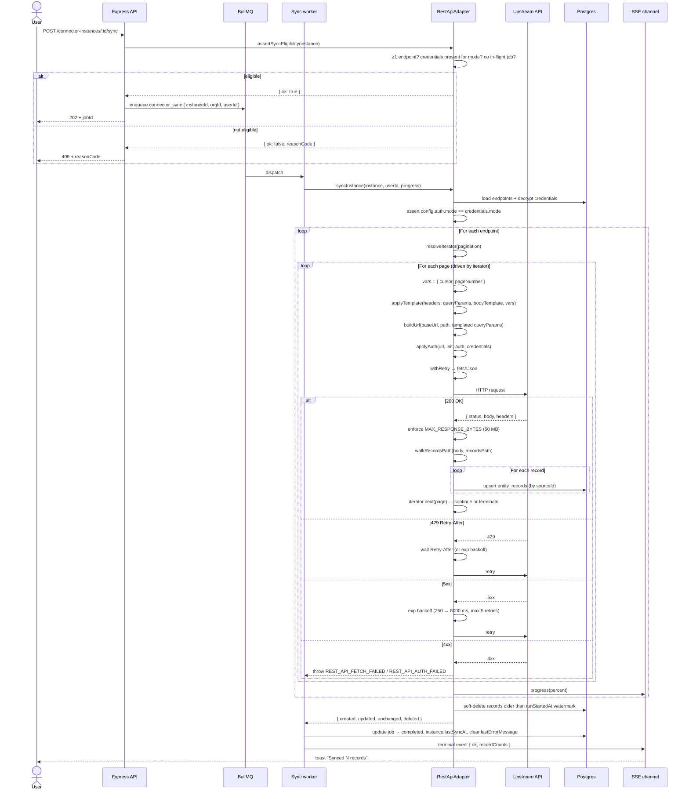
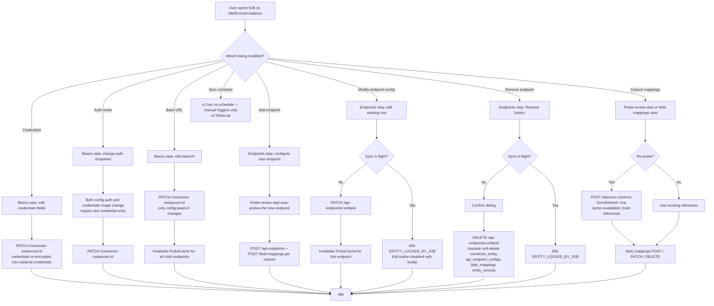
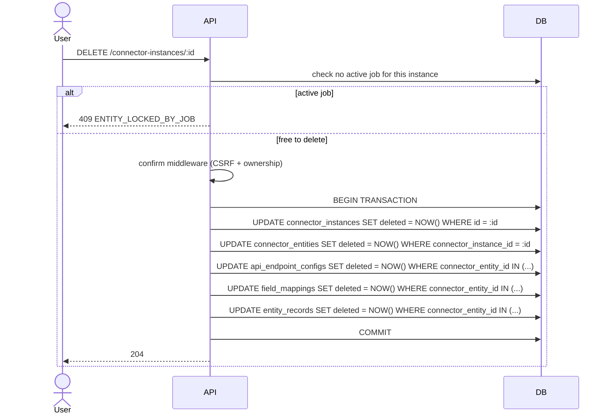

# API connector — Lifecycle

**Runtime companion to the discovery + per-phase docs.** Shows how a REST API connector instance moves through its lifetime: creation, syncing, modification, and removal. Where the spec/plan files describe *what* is built, this doc describes *what happens* once it's running.

Discovery: `docs/API_CONNECTOR.discovery.md`. Per-phase contracts: `docs/API_CONNECTOR_PHASE_{1,2,3,4}.{spec,plan}.md`.

---

## High-level state

Every instance moves through a small set of states. Transitions are driven by user action (workflow / Edit / Delete), by the sync queue (job dispatch), or by sync completion.

| State | What it means | Persisted form |
|---|---|---|
| Configuring | The user is in the workflow building or editing the instance. Nothing is durable until commit. | (Browser state only.) |
| Idle | Instance exists, no `connector_sync` job in flight, `lastErrorMessage` is null. | `connector_instances` row with `status = "active"`, no active job in `jobs`. |
| Syncing | A `connector_sync` job is active (`status IN ("pending", "active")`). Entity lock held; mutations rejected. | Active row in `jobs` table linked by metadata. |
| Errored | The last sync failed; the instance can still be edited or re-synced. | `connector_instances.lastErrorMessage` populated; no active job. |
| SoftDeleted | `deleted` column set; cascades to all child rows. Read-only forever. | `connector_instances.deleted = NOW()` (+ same on every child). |

---

## Creation

User clicks "Add connector" → picks "REST API" → walks four workflow steps → commit lands the instance + endpoints + field mappings.

Notes:

- Test-connection and discover-columns both use the same `fetchFirstPage` helper internally — single page fetched, auth applied, templating substituted with `{ cursor: "", pageNumber: 1 }`, retries applied. They differ in what they do with the result: test-connection returns a sample for human inspection; discover-columns runs `inferColumns` and caches.
- Probe results are cached in-process for 60 s keyed by `connectorEntityId` — but during the *first* workflow walk-through the endpoint doesn't have an id yet (it's being created). The probe at this step uses a draft-id passed by the workflow; the cache is keyed by that draft-id and discarded once commit assigns real ids. (Implementation note for the slice 6 phase-4 component: use `crypto.randomUUID()` for the draft id; the cache entry never gets reused across workflow sessions.)
- The Basics step is the only place credentials live in browser memory. They're held in component state, never persisted to local storage / cookies / session storage. Submission encrypts on the server and the browser drops them when the workflow unmounts.

---

## Sync

Either user-triggered (button in instance detail view) or, in the future, scheduled. v1 is poll-on-demand only.

Failure handoffs from this diagram:

| Adapter raises | Worker writes | User sees |
|---|---|---|
| `REST_API_AUTH_FAILED` | job → failed, `lastErrorMessage` set | "API rejected the credentials. Re-save the connector." |
| `REST_API_RATE_LIMITED` (after 5 retries on 429) | job → failed | "API is rate-limiting us. Try again later." |
| `REST_API_FETCH_FAILED` (4xx other than 401/403, or 5xx after retries) | job → failed | Code + status + URL in the error toast. |
| `REST_API_RESPONSE_TOO_LARGE` | job → failed | "Response > 50 MB. Enable pagination or reduce page size. (#72)" |
| `REST_API_RECORDS_PATH_NOT_FOUND` / `_NOT_ARRAY` | job → failed | "Couldn't find records at `<path>`." |
| `REST_API_TEMPLATE_UNKNOWN_VARIABLE` | (caught at save time, not sync time) | "Unknown template variable `{{x}}`." |

Reconciliation rules (after the fetch loop):

- If endpoint has `idField` set → records present in the prior sync but missing from the new fetch are soft-deleted via watermark.
- If endpoint has `idField` unset → every record gets a synthetic `api:<runStartedAt>:<index>` sourceId, so the diff resolves to "every prior record deleted, every new record created" — full replacement.

---

## Modifications

Once active, an instance can be modified through the Edit flow. Each modification type follows the same lock-respect-then-write pattern but writes to different rows.

Cache invalidation on modification:

- **baseUrl change** → ProbeCache invalidated for every endpoint under the instance (the underlying URL changed; samples from old base may be wrong).
- **Endpoint config change** (any field) → ProbeCache invalidated for that endpoint.
- **Credentials change** → ProbeCache NOT invalidated (auth applies to the request, not to the parsed response shape; samples cached pre-credentials-rotation are still structurally valid).
- **Field-mapping change** → ProbeCache untouched (mappings are downstream of probe; the probe describes the upstream).

Concurrency guard:

- Every mutation route (`PATCH`, `DELETE`) on the instance or its endpoints runs the `ENTITY_LOCKED_BY_JOB` middleware. If a `connector_sync` job is in `pending` or `active` state for the affected `connectorInstanceId`, the route returns `409` immediately. Front-end disables the button + shows a tooltip explaining the lock.
- The reverse case — trying to enqueue a sync while another is in flight — is handled by `assertSyncEligibility`, not the lock middleware (different code path, same outcome: `409`).

---

## Deletion

Deletion is **soft** all the way down — every child row gets `deleted = NOW()`, no rows are actually removed. The `Repository<>` base class's reads filter `WHERE deleted IS NULL` everywhere, so the soft-deleted rows become invisible to all feature paths. A future maintenance ticket could add a hard-delete sweep for ancient soft-deleted rows; out of scope here.

Side effects:

- The instance's `ProbeCache` entries (one per endpoint) are dropped at the route layer — they'd expire on TTL anyway, but the explicit drop keeps the cache footprint bounded.
- Any in-flight sync would have been blocked by the lock check; there's never a deletion racing a running sync.
- Wide-table columns (`er__<entityId>`) created by the wide-table reconciler are NOT dropped at this point — that runs through the separate maintenance job per `docs/ENTITY_RECORDS_WIDE_TABLE` phase 5. Until then the wide table sits as a tombstone alongside the soft-deleted rows.

---

## Key invariants across the lifetime

These are the rules that hold at every state. They're the underlying reason most of the modification paths exist.

| Invariant | Where it's enforced | What goes wrong if violated |
|---|---|---|
| **Auth mode in `config` matches mode in decrypted `credentials`** | `applyAuth` (every fetch), `assertSyncEligibility` (every sync) | Silent auth failures; `REST_API_AUTH_FAILED` with `details.mismatch`. |
| **One `api_endpoint_configs` row per live `connector_entity`** | Partial unique index `WHERE deleted IS NULL` | Two endpoints with the same entity key on one instance; mappings ambiguous. |
| **`connector_entities.key` unique per organization (live rows only)** | Existing `connector_entities_org_key_unique` index | `field_mapping.refEntityKey` can't resolve to a unique entity. |
| **Pagination value matches the CHECK constraint** | Table-level `pagination IN ('none', 'pageOffset', 'cursor', 'linkHeader')` | Schema drift; would only happen via raw SQL. |
| **Body template only on POST methods** | Zod refine on `ApiEndpointConfigSchema` | A GET request with body_template would silently drop the body; routes 400 before persisting. |
| **Templated strings reference only `{{cursor}}` and `{{pageNumber}}`** | `applyTemplate` (sync time) + frontend lint (save time) | An unknown variable would silently substitute to empty string; closed-set check catches it early. |
| **No mutation while a `connector_sync` job is in flight** | `ENTITY_LOCKED_BY_JOB` middleware on every write route | Editing pagination mid-sync could leave records orphaned across page boundaries. |
| **No two concurrent syncs on the same instance** | `assertSyncEligibility` step 3 | Double-counted records; out-of-order watermark soft-deletes. |
| **`MAX_RESPONSE_BYTES` cap enforced on every fetch** | `fetchJson` (fast path + slow path) | OOM on unpaginated huge JSON responses; converted to `REST_API_RESPONSE_TOO_LARGE`. Streaming lift tracked in [#72](https://github.com/EnterpriseBT/portal-ai/issues/72). |
| **Probe cache TTL = 60 s in-process** | `ProbeCache` get/set | Stale samples shown in the workflow; mitigated by Re-probe button and on-modify invalidation. |
| **AI-assist failures never abort the probe** | `discoverColumns`'s try/catch around the classifier | Without the catch, an LLM hiccup would make the entire workflow's probe step error out — instead the user just gets heuristic-only output + the degradation banner. |
| **`runStartedAt` watermark per sync** | Adapter's sync orchestration | Without watermark, can't distinguish "missing in this sync" from "missing because we haven't reached that page yet" → false deletes. |

---

## What this doc doesn't show

- **Wide-table reconciler interactions.** Every `field_mapping` mutation triggers the existing reconciler (`docs/ENTITY_RECORDS_WIDE_TABLE` machinery) to keep the per-entity wide table in sync. That flow is identical to every other connector and is documented separately.
- **SSE event payload details.** Sync progress events use the existing `/api/sse/jobs/:id/events` channel; the REST API connector emits the same `{ percent }` and terminal `{ ok, recordCounts }` shapes as Google Sheets and Excel.
- **Per-organization rate-limit caps** (v2 follow-up).
- **OAuth2 lifecycle** — token refresh, re-consent, account chip updates. Deferred to v2 alongside the OAuth modes themselves.
- **Webhook-driven sync** — separate ticket if it ever lands.
